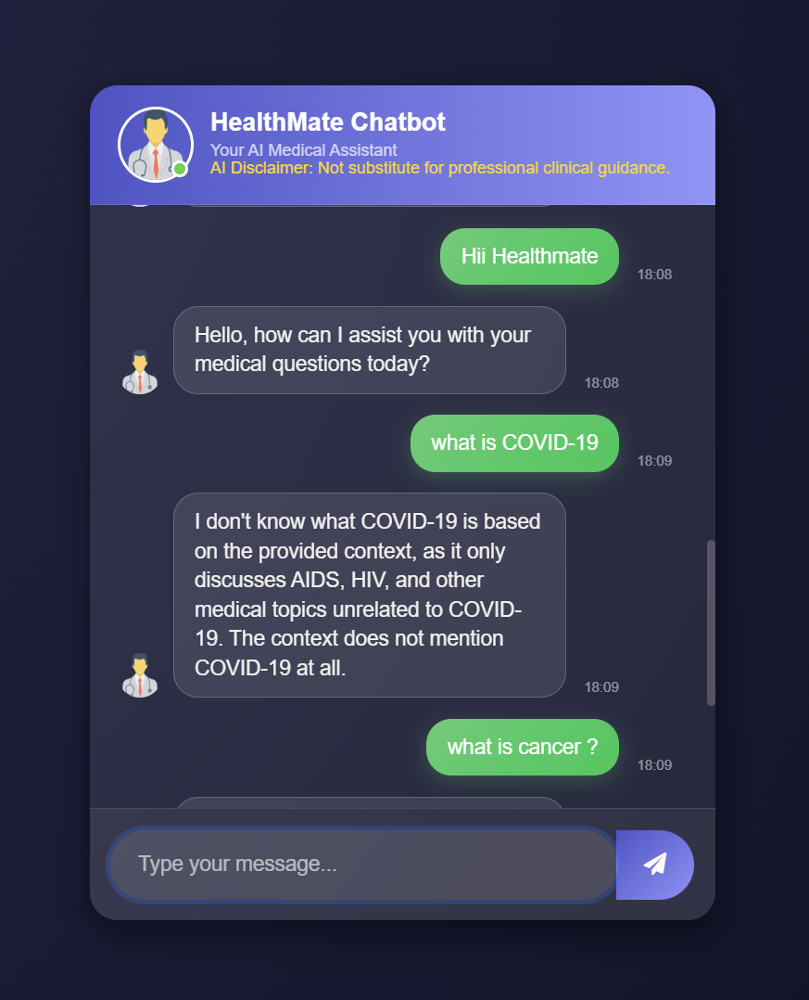
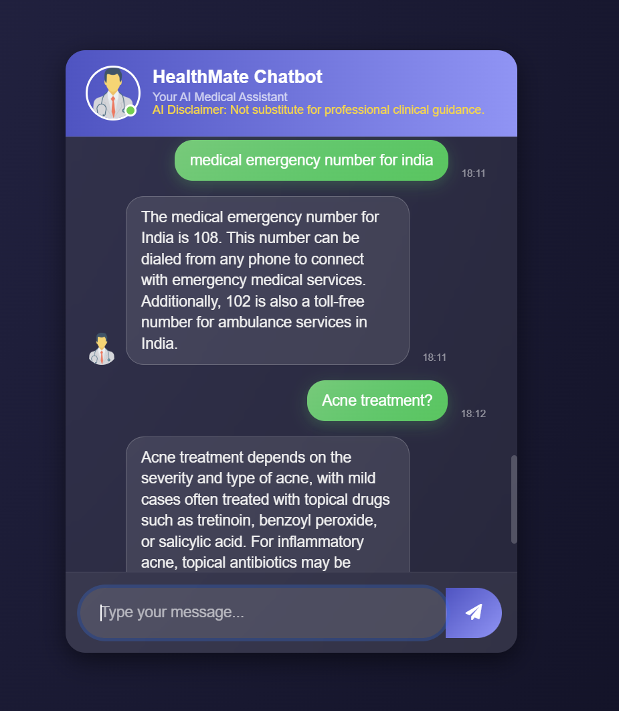

⚕️ HealthMate AI Chatbot
Your AI Medical Assistant — RAG Powered, Zero-Hallucination

HealthMate is a fully deployed Retrieval-Augmented Generation (RAG) medical chatbot that provides strictly factual answers from a verified medical knowledge base (PDF).
The system is engineered for safety, accuracy, and reliability, ensuring zero hallucination through strict context-bound generation.

🚀 Key Features

Zero-Hallucination Guardrails
Only answers using retrieved context from the medical PDF.
Refuses unrelated questions safely.

High-Speed Inference (Groq + Llama 3-70B)
Ultra-fast real-time responses using Groq LPU acceleration.

Full RAG Pipeline
PDF Chunking → Embeddings → Pinecone Vector Search → LLM Answer Synthesis.

Full-Stack Deployment (Render)
Flask backend + modern HTML/CSS/JS interface.

Clinically Safe Interaction
Strict refusal template for out-of-context medical queries.
## 🖼️ Demo (UI Screenshot)

Below is a preview screenshot of the application UI:

## 🖼️ Demo (UI Screenshot)

Below is a preview screenshot of the application UI:

🏗️ System Architecture
1️⃣ Offline Phase: Knowledge Base Preparation

Extract PDF text

Split into chunks

Generate embeddings using MiniLM-L6-v2

Store embeddings in Pinecone

2️⃣ Online Phase: User Query Pipeline

User asks a question

Query → Embedding generated

Pinecone retrieves top-k relevant chunks

Llama 3-70B (via Groq) generates answer strictly from retrieved chunks

If no context → safe refusal message

🛠️ Technology Stack
Component	Used For
Llama 3-70B (Groq)	High-speed inference
Pinecone	Vector database for semantic search
MiniLM-L6-v2	Embedding generation
Flask (Python)	Backend server
Render	Cloud deployment
HTML, CSS, JS	Frontend interface
📂 Project Structure
HealthMate_AI_Chatbot/
│── static/
│   ├── style.css
│   └── script.js
│── templates/
│   └── index.html
│── store_index.py
│── app.py
│── embeddings/
│── .env
│── README.md
│── Health_mate_chatbot_demo.png
│── Health_mate_chatbot_demo_2.png

⚙️ Installation & Setup
1️⃣ Clone Repository
git clone https://github.com/krish5143/HealthMate_AI_Chatbot
cd HealthMate_AI_Chatbot

2️⃣ Install Dependencies
pip install -r requirements.txt

3️⃣ Add Environment Variables

Create .env:

PINECONE_API_KEY=your_key
GROQ_API_KEY=your_key

4️⃣ Build Vector Index
python store_index.py

5️⃣ Run Application
python app.py

App will run at: locally
👉 http://127.0.0.1:5000  

⚠️ Medical Disclaimer

This chatbot provides education-only information from the medical PDF.
It is not a replacement for professional medical diagnosis or treatment.
